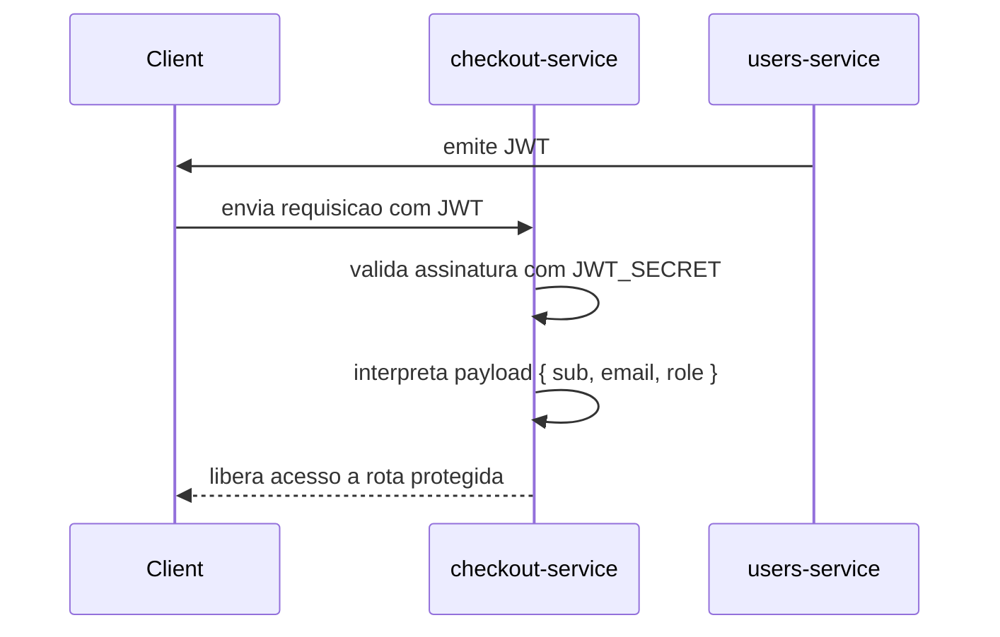
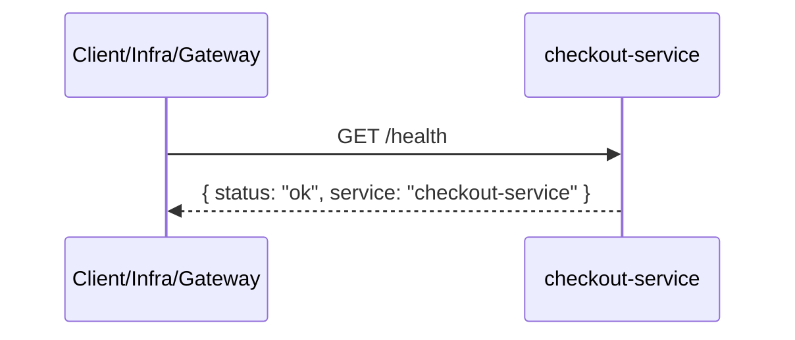
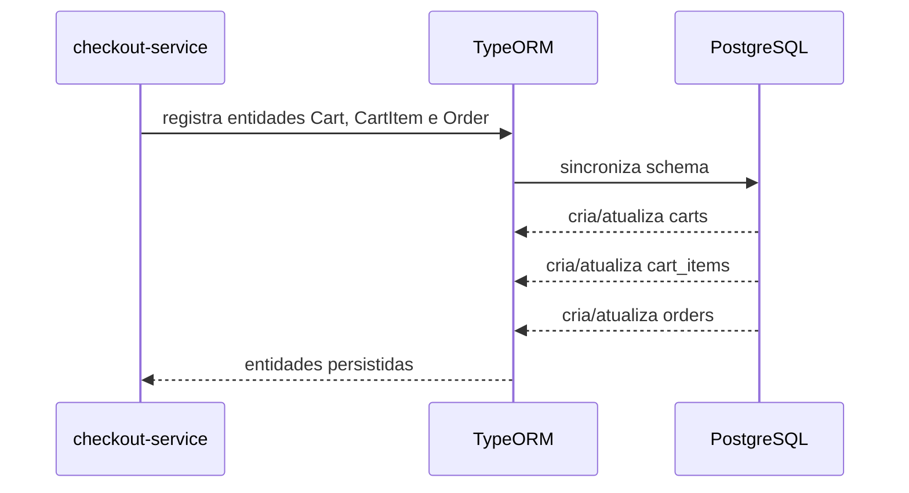
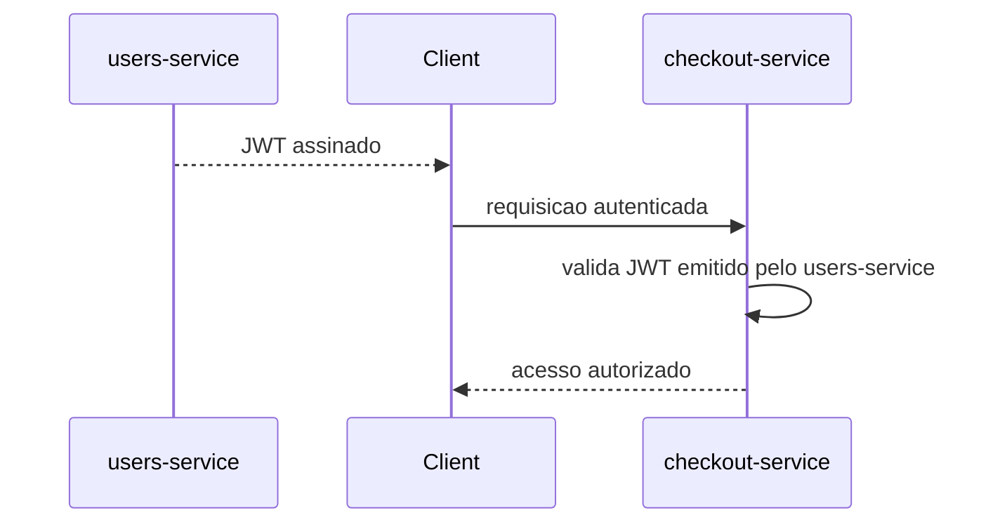

# Spec: Entidades de Domínio e JWT no checkout-service

## Visão geral

Esta spec define a base funcional e estrutural do `checkout-service` no projeto `marketplace`, cobrindo a criação das primeiras entidades de domínio, a organização modular do serviço, a autenticação JWT e os requisitos mínimos de observabilidade e documentação.

O objetivo desta entrega é preparar o `checkout-service` para as próximas specs de carrinho e pedidos, garantindo persistência real no PostgreSQL, validação de identidade do usuário e um ponto mínimo de health check e documentação.

| Item | Valor |
|------|-------|
| Serviço | `checkout-service` |
| Porta | `4002` |
| Banco | PostgreSQL |
| Porta do banco | `5432` |
| Escopo | Fundação de domínio, autenticação e bootstrap do serviço |

---

## Fluxos de dados visuais

### Fluxo visual da autenticação JWT

```text
Client
  -> envia JWT
checkout-service
  -> valida assinatura com JWT_SECRET compartilhado
  -> interpreta payload { sub, email, role }
  -> expõe req.user para os endpoints protegidos
```



### Fluxo visual do health check

```text
Client / Infra / Gateway
  -> GET /health
checkout-service
  -> responde { status: "ok", service: "checkout-service" }
```



### Fluxo visual da persistência inicial

```text
checkout-service
  -> TypeORM
  -> PostgreSQL
     -> tabela carts
     -> tabela cart_items
     -> tabela orders
```



### Fluxo visual entre serviços

```text
users-service
  -> emite JWT
Client
  -> envia JWT para checkout-service
checkout-service
  -> valida token emitido pelo users-service
  -> permite acesso a rotas protegidas
```



---

## 1. Requisitos funcionais

### 1.1 Persistência de domínio

- O `checkout-service` deve deixar de operar sem entidades persistidas.
- O TypeORM deve passar a gerenciar entidades reais de domínio para carrinho e pedido.
- A modelagem inicial deve contemplar apenas os agregados necessários para carrinho, itens do carrinho e pedido.
- Esta entrega não deve incluir endpoints CRUD.

### 1.2 Organização modular

- O serviço deve possuir um `CartModule` para concentrar o domínio de carrinho.
- O serviço deve possuir um `OrdersModule` para concentrar o domínio de pedidos.
- Cada módulo deve registrar suas respectivas entidades com `TypeOrmModule.forFeature`.
- A organização modular deve permitir evolução posterior sem acoplamento indevido entre domínio, autenticação e integração de eventos.

### 1.3 Autenticação JWT

- O `checkout-service` deve validar JWT emitido externamente pelo `users-service`.
- O payload esperado do token deve ser compatível com `{ sub: UUID, email: string, role: "seller" | "buyer" }`.
- O serviço deve utilizar o mesmo `JWT_SECRET` compartilhado com o `users-service`.
- O padrão de autenticação deve seguir a mesma abordagem já adotada no `products-service`, incluindo:
  - `AuthModule`;
  - `JwtStrategy`;
  - `JwtAuthGuard` global;
  - decorator `@Public()`.

### 1.4 Health check público

- O serviço deve expor `GET /health`.
- A rota deve ser pública e não exigir autenticação.
- A resposta deve retornar exatamente `{ status: "ok", service: "checkout-service" }`.

### 1.5 Swagger básico

- O serviço deve disponibilizar documentação Swagger/OpenAPI básica.
- A documentação deve refletir os endpoints disponíveis no serviço nesta etapa.
- A documentação deve indicar suporte a autenticação Bearer.
- O health check público deve constar na documentação.

### 1.6 Registro no módulo raiz

- `AppModule` deve registrar os módulos necessários para:
  - autenticação;
  - domínio de carrinho;
  - domínio de pedidos;
  - health check.
- O `EventsModule` existente deve permanecer registrado e inalterado.

---

## 2. Modelo de domínio

### 2.1 Entidade Cart

A entidade `Cart` representa o carrinho de compras do usuário autenticado.

| Campo | Tipo | Obrigatório | Regra |
|-------|------|-------------|-------|
| `id` | UUID | Sim | Identificador único |
| `userId` | UUID | Sim | Identificador do dono do carrinho |
| `status` | enum | Sim | Valores permitidos: `active`, `completed`, `abandoned` |
| `amount` | decimal(10,2) | Sim | Valor total do carrinho, padrão `0` |
| `items` | relação | Sim | `OneToMany` para `CartItem`, com `cascade` e `eager` |
| `createdAt` | timestamp | Sim | Data de criação |
| `updatedAt` | timestamp | Sim | Data da última atualização |

Regras adicionais:

- O status padrão do carrinho deve ser `active`.
- O amount deve iniciar com `0`.
- O carrinho deve manter relacionamento direto com seus itens.

### 2.2 Entidade CartItem

A entidade `CartItem` representa um item pertencente a um carrinho.

| Campo | Tipo | Obrigatório | Regra |
|-------|------|-------------|-------|
| `id` | UUID | Sim | Identificador único |
| `cart` | relação | Sim | `ManyToOne` para `Cart` |
| `cartId` | UUID | Sim | Referência direta ao carrinho |
| `productId` | UUID | Sim | Identificador do produto |
| `productName` | varchar(255) | Sim | Nome do produto no momento do item |
| `price` | decimal(10,2) | Sim | Preço unitário |
| `quantity` | int | Sim | Quantidade do item, padrão `1` |
| `subtotal` | decimal(10,2) | Sim | Preço total do item |
| `createdAt` | timestamp | Sim | Data de criação |

Regras adicionais:

- A relação com `Cart` deve utilizar exclusão em cascata.
- O `quantity` deve iniciar com `1`.
- O `subtotal` deve representar o valor consolidado do item.

### 2.3 Entidade Order

A entidade `Order` representa um pedido originado a partir de um carrinho.

| Campo | Tipo | Obrigatório | Regra |
|-------|------|-------------|-------|
| `id` | UUID | Sim | Identificador único |
| `userId` | UUID | Sim | Identificador do comprador |
| `cartId` | UUID | Sim | Referência ao carrinho de origem |
| `amount` | decimal(10,2) | Sim | Valor do pedido |
| `status` | enum | Sim | Valores permitidos: `pending`, `paid`, `failed`, `cancelled` |
| `paymentMethod` | varchar(50) | Sim | Forma de pagamento |
| `createdAt` | timestamp | Sim | Data de criação |
| `updatedAt` | timestamp | Sim | Data da última atualização |

Regras adicionais:

- O status padrão do pedido deve ser `pending`.
- O pedido deve manter o vínculo lógico com o carrinho que o originou.

### 2.4 Enumerações de domínio

Devem existir enumerações explícitas para os estados do domínio:

- status de carrinho:
  - `active`
  - `completed`
  - `abandoned`
- status de pedido:
  - `pending`
  - `paid`
  - `failed`
  - `cancelled`

---

## 3. Requisitos de autenticação

### 3.1 AuthModule

- O serviço deve possuir um `AuthModule` próprio.
- O módulo deve centralizar a infraestrutura de autenticação JWT do `checkout-service`.
- O módulo não deve criar endpoints de login, registro ou refresh token.

### 3.2 JwtStrategy

- A `JwtStrategy` deve validar tokens com o mesmo `JWT_SECRET` usado pelo `users-service`.
- A estratégia deve considerar o payload padrão com `sub`, `email` e `role`.
- O usuário autenticado deve ficar disponível no request para uso nas próximas specs.

### 3.3 JwtAuthGuard global

- O `JwtAuthGuard` deve ser registrado globalmente no serviço por meio de `APP_GUARD`.
- Rotas não públicas devem exigir token válido por padrão.

### 3.4 Decorator @Public()

- O serviço deve possuir o decorator `@Public()`.
- O decorator deve permitir a marcação explícita de rotas públicas.
- O endpoint `GET /health` deve utilizar esse comportamento.

---

## 4. Requisitos de documentação e observabilidade

### 4.1 Health check

- O endpoint `GET /health` deve ser o ponto padrão de verificação do serviço.
- O endpoint deve permanecer desacoplado da autenticação.
- O retorno deve ser simples, estável e apropriado para consumo por outros serviços ou por infraestrutura.

### 4.2 Swagger/OpenAPI

- O serviço deve disponibilizar documentação automática.
- A documentação deve representar com clareza:
  - o health check público;
  - a existência de autenticação Bearer nas rotas protegidas.
- Como esta etapa não inclui endpoints CRUD de domínio, a documentação pode permanecer enxuta, desde que corretamente configurada.

---

## 5. Registro no AppModule

- `AppModule` deve continuar registrando `ConfigModule` e `TypeOrmModule`.
- `AppModule` deve passar a registrar:
  - `DomainModule` que então deve passar a registar:
    - `AuthModule`;
    - `CartModule`;
    - `OrdersModule`;
    - módulo de health check.
- `EventsModule` deve continuar presente sem alteração de responsabilidade ou comportamento.

---

## 6. Respostas esperadas

### 6.1 Health check

- **200 OK**: `GET /health` retorna `{ status: "ok", service: "checkout-service" }`.

### 6.2 Autenticação

- **401 Unauthorized**: rota protegida acessada sem token, com token inválido ou expirado.

---

## 7. Critérios de aceite

### Estrutura de domínio

- [ ] **CA-01** — O `checkout-service` possui a entidade `Cart` registrada no TypeORM.
- [ ] **CA-02** — O `checkout-service` possui a entidade `CartItem` registrada no TypeORM.
- [ ] **CA-03** — O `checkout-service` possui a entidade `Order` registrada no TypeORM.
- [ ] **CA-04** — O TypeORM passa a gerenciar tabelas reais para o domínio do `checkout-service`.
- [ ] **CA-05** — `Cart` possui relacionamento `OneToMany` com `CartItem`.
- [ ] **CA-06** — `CartItem` possui relacionamento `ManyToOne` com `Cart`.
- [ ] **CA-07** — A exclusão de um carrinho remove seus itens associados.
- [ ] **CA-08** — `Cart.status` aceita apenas `active`, `completed` e `abandoned`, com padrão `active`.
- [ ] **CA-09** — `Cart.amount` usa decimal `10,2` com valor inicial `0`.
- [ ] **CA-10** — `CartItem.quantity` possui valor padrão `1`.
- [ ] **CA-11** — `Order.status` aceita apenas `pending`, `paid`, `failed` e `cancelled`, com padrão `pending`.
- [ ] **CA-12** — `Order.amount` usa decimal `10,2`.
- [ ] **CA-13** — `paymentMethod` existe em `Order` com limite compatível de `varchar(50)`.

### Organização modular

- [ ] **CA-14** — Existe um `CartModule` no serviço.
- [ ] **CA-15** — Existe um `OrdersModule` no serviço.
- [ ] **CA-16** — `CartModule` registra suas entidades via `TypeOrmModule.forFeature`.
- [ ] **CA-17** — `OrdersModule` registra suas entidades via `TypeOrmModule.forFeature`.

### Autenticação JWT

- [ ] **CA-18** — Existe um `AuthModule` no `checkout-service`.
- [ ] **CA-19** — Existe uma `JwtStrategy` compatível com o payload emitido pelo `users-service`.
- [ ] **CA-20** — Existe um `JwtAuthGuard` registrado globalmente via `APP_GUARD`.
- [ ] **CA-21** — Existe um decorator `@Public()` no serviço.
- [ ] **CA-22** — Rotas protegidas exigem JWT válido por padrão.
- [ ] **CA-23** — O serviço usa o mesmo `JWT_SECRET` compartilhado com o `users-service`.

### Health check e documentação

- [ ] **CA-24** — Existe um endpoint público `GET /health`.
- [ ] **CA-25** — `GET /health` retorna `200 OK`.
- [ ] **CA-26** — `GET /health` retorna exatamente `{ status: "ok", service: "checkout-service" }`.
- [ ] **CA-27** — O serviço disponibiliza documentação Swagger/OpenAPI básica.
- [ ] **CA-28** — A documentação indica suporte a Bearer Auth.
- [ ] **CA-29** — O endpoint `GET /health` aparece na documentação.

### Registro no módulo raiz

- [ ] **CA-30** — `AppModule` registra `AuthModule`, `CartModule`, `OrdersModule` e o módulo de health.
- [ ] **CA-31** — `EventsModule` continua registrado no `AppModule`.
- [ ] **CA-32** — O `EventsModule` não sofre alteração funcional nesta entrega.

### Restrições de escopo

- [ ] **CA-33** — Nenhum endpoint CRUD de carrinho ou pedido é criado nesta spec.
- [ ] **CA-34** — A entrega não altera o `EventsModule` nem a integração RabbitMQ existente.

---

## 8. Fora de escopo

Esta spec não inclui:

- criação de endpoints de carrinho;
- criação de endpoints de pedido;
- regras de negócio de adicionar, remover ou atualizar itens do carrinho;
- fluxo de fechamento de pedido;
- integração com `products-service` para validar produtos;
- integração com `users-service` além da validação do JWT;
- consumo ou alteração do `EventsModule`;
- publicação de eventos de checkout;
- testes automatizados detalhados de implementação.
