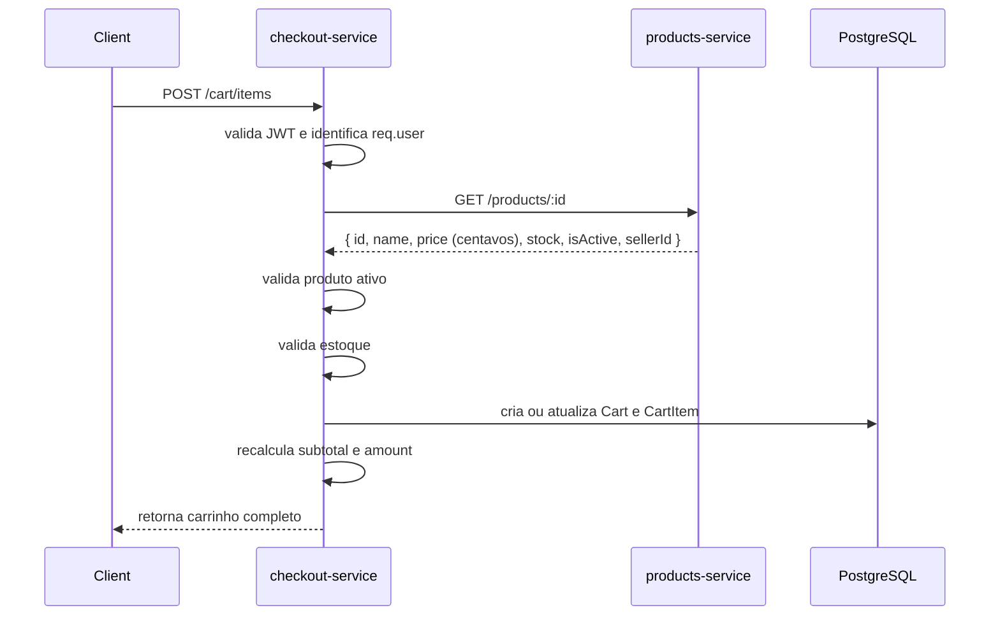
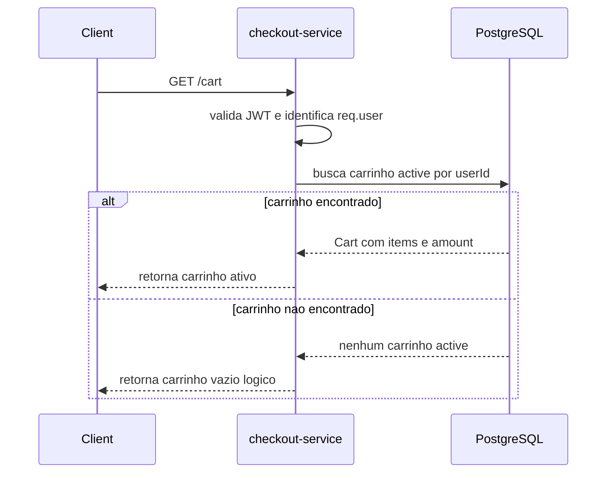
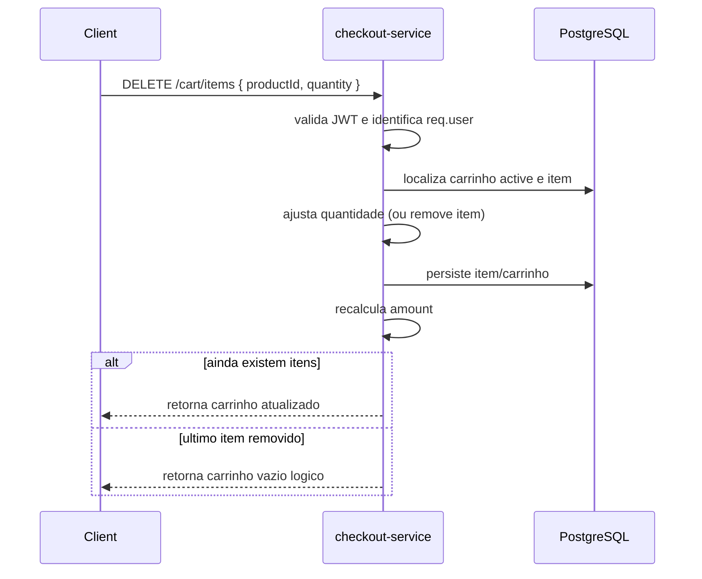
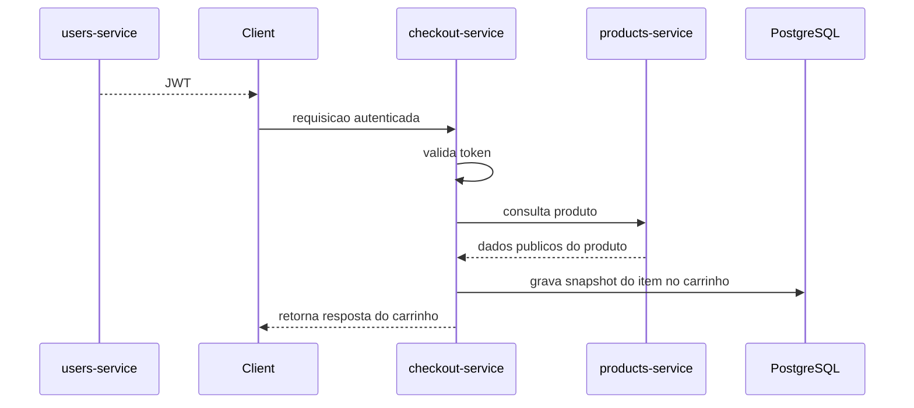

# Spec: Gerenciamento do Carrinho no checkout-service

## Visão geral

Esta spec define a primeira camada funcional de gerenciamento de carrinho no `checkout-service` do projeto `marketplace`, cobrindo comunicação com o `products-service`, adição de itens, consulta do carrinho ativo e remoção de itens.

O objetivo desta entrega é permitir que usuários autenticados mantenham um carrinho ativo com snapshot de produto, cálculo de subtotais e consolidação do `amount` do carrinho, sem ainda executar o fluxo de checkout/finalização do pedido.

### Representação monetária (centavos)

- No `checkout-service`, os valores monetários são persistidos e calculados como inteiros em centavos (evita ponto flutuante):
  - `Cart.amount`: centavos (`int`)
  - `CartItem.price`: centavos (`int`)
  - `CartItem.subtotal`: centavos (`int`)
- Conversão para Reais (ex: `19999` → `199.99`) deve ocorrer apenas na borda pública do sistema, por exemplo no `api-gateway` (respostas externas) e, quando necessário, no `payments-service`.

| Item | Valor |
|------|-------|
| Serviço | `checkout-service` |
| Porta | `4002` |
| Banco | PostgreSQL |
| Dependência externa | `products-service` |
| Porta dependência | `4004` |
| Escopo | Gerenciamento do carrinho ativo do usuário |

---

## Fluxos de dados visuais

### Fluxo visual de adição ao carrinho

```text
Client
  -> POST /cart/items
checkout-service
  -> valida JWT
  -> identifica req.user
  -> consulta produto no products-service
products-service
  -> retorna { id, name, price (centavos), stock, isActive, sellerId }
checkout-service
  -> valida produto ativo
  -> valida estoque
  -> cria ou atualiza CartItem
  -> recalcula amount do Cart
  -> persiste em PostgreSQL
  -> retorna carrinho completo
```



### Fluxo visual de consulta do carrinho

```text
Client
  -> GET /cart
checkout-service
  -> valida JWT
  -> identifica req.user
  -> busca carrinho active no PostgreSQL
  -> retorna carrinho com items e amount
     ou
  -> retorna carrinho vazio logico
```



### Fluxo visual de remoção de item

```text
Client
  -> DELETE /cart/items { productId, quantity }
checkout-service
  -> valida JWT
  -> identifica req.user
  -> localiza carrinho active do usuario
  -> localiza item por productId
  -> se quantity == item.quantity: remove o item
  -> se quantity < item.quantity: decrementa quantidade e recalcula subtotal
  -> recalcula amount
  -> retorna carrinho atualizado ou carrinho vazio logico (se ultimo item removido)
```



### Fluxo visual entre serviços

```text
users-service
  -> emite JWT
Client
  -> envia JWT para checkout-service
checkout-service
  -> valida token
  -> chama products-service para consultar produto
products-service
  -> devolve dados publicos do produto
checkout-service
  -> grava snapshot do item no PostgreSQL
```



---

## 1. Requisitos funcionais

### 1.1 Comunicação com products-service

O `checkout-service` deve possuir um `ProductsClientService` responsável pela comunicação HTTP com o `products-service`.

Requisitos:

- Deve existir um método `getProduct(productId)` para consultar produto por identificador.
- A consulta deve usar `GET /products/:id` no `products-service`.
- A comunicação deve utilizar `HttpModule` do NestJS (`@nestjs/axios`).
- A URL base do `products-service` deve ser configurada pela variável `PRODUCTS_SERVICE_URL`.

Resultado esperado:

- O `checkout-service` deve conseguir obter os dados públicos do produto necessários para validar adição ao carrinho:
  - `id`
  - `name`
  - `price`
  - `stock`
  - `isActive`
  - `sellerId`

### 1.2 Endpoint `POST /cart/items`

O serviço deve expor um endpoint protegido `POST /cart/items` para adicionar itens ao carrinho do usuário autenticado.

Entrada esperada:

- `productId` (UUID)
- `quantity` (inteiro maior ou igual a `1`)

Comportamento esperado:

- O endpoint deve identificar o usuário pelo token JWT.
- O serviço deve consultar o produto no `products-service` antes de adicionar o item.
- O produto deve ser considerado válido apenas quando:
  - existir;
  - estiver ativo (`isActive: true`).
- Se o usuário ainda não possuir carrinho com status `active`, o serviço deve considerar um carrinho ativo para a operação.
- Se o produto ainda não existir no carrinho ativo, um novo item deve ser incluído.
- Se o produto já existir no carrinho ativo, a quantidade do item existente deve ser somada à nova quantidade recebida.
- O `CartItem` deve armazenar snapshot do produto no momento da adição:
  - `productId`
  - `productName`
  - `price`
- O `subtotal` do item deve ser recalculado com base em `price × quantity`.
- O `amount` do carrinho deve ser recalculado pela soma de todos os subtotais.

Saída esperada:

- O endpoint deve retornar o carrinho ativo completo do usuário.
- A resposta deve incluir os itens do carrinho e o `amount` atualizado.

### 1.3 Endpoint `GET /cart`

O serviço deve expor um endpoint protegido `GET /cart` para consultar o carrinho ativo do usuário autenticado.

Comportamento esperado:

- O endpoint deve identificar o usuário pelo token JWT.
- O serviço deve retornar o carrinho ativo do usuário com seus itens e `amount`.
- Se o usuário não possuir carrinho ativo, o endpoint deve retornar um carrinho vazio.

Contrato funcional do carrinho vazio:

- O resultado deve representar ausência de itens.
- O `amount` deve ser `0`.
- A resposta deve ser compatível com o mesmo contrato funcional usado para retorno do carrinho ativo.

### 1.4 Endpoint `DELETE /cart/items`

O serviço deve expor um endpoint protegido `DELETE /cart/items` para remover (total ou parcialmente) um item do carrinho ativo do usuário autenticado.

Entrada esperada:

- `productId` (UUID)
- `quantity` (inteiro maior ou igual a `1`)

Comportamento esperado:

- O endpoint deve identificar o usuário pelo token JWT.
- O item informado por `productId` deve pertencer ao carrinho ativo do próprio usuário.
- Se `quantity` for igual à quantidade atual do item, o item deve ser removido do carrinho.
- Se `quantity` for menor que a quantidade atual do item, o serviço deve:
  - decrementar a quantidade;
  - recalcular `subtotal` como `price × quantity`.
- Após a remoção/ajuste, o `amount` do carrinho deve ser recalculado como soma dos subtotais.
- Se o carrinho ficar sem itens, o carrinho deve ser removido e o endpoint deve retornar carrinho vazio.

---

## 2. Regras de negócio

### 2.1 Carrinho ativo por usuário

- Cada usuário pode possuir no máximo um carrinho com status `active`.
- Sellers e buyers podem possuir carrinho.
- Toda manipulação de carrinho deve ocorrer exclusivamente sobre o carrinho ativo do usuário autenticado.

### 2.2 Isolamento por usuário

- Um usuário só pode consultar o próprio carrinho.
- Um usuário só pode adicionar itens ao próprio carrinho.
- Um usuário só pode remover itens do próprio carrinho.

### 2.3 Snapshot de produto

- O nome e o preço do produto devem ser armazenados no `CartItem` no momento da adição ao carrinho.
- Alterações futuras no produto no `products-service` não devem reescrever automaticamente o snapshot já salvo no carrinho.

### 2.4 Cálculo de valores

- `price`, `subtotal` e `amount` são valores em centavos.
- O `subtotal` do item deve representar `price × quantity` (em centavos).
- O `amount` do carrinho deve representar a soma de todos os subtotais dos itens (em centavos).
- O `amount` deve ser recalculado sempre que um item for adicionado, atualizado por soma de quantidade ou removido.

### 2.5 Validação do produto

- Apenas produtos existentes podem ser adicionados ao carrinho.
- Apenas produtos ativos podem ser adicionados ao carrinho.

### 2.6 Simplificações desta etapa

- O ajuste de quantidade é feito por deltas via `POST /cart/items` (incremento) e `DELETE /cart/items` (decremento/remover).
- Esta entrega não deve implementar checkout, finalização de pedido ou publicação de evento de pagamento.

---

## 3. Respostas esperadas

### 3.1 `POST /cart/items`

- **200 OK**: item adicionado com sucesso e carrinho retornado com `amount` atualizado.
- **400 Bad Request**: payload inválido, incluindo `quantity < 1` ou UUID inválido.
- **401 Unauthorized**: ausência de token, token inválido ou expirado.
- **404 Not Found**: produto inexistente ou item/carrinho não encontrado quando aplicável ao fluxo.
- **422 Unprocessable Entity**: produto encontrado, porém inativo para uso no carrinho.

### 3.2 `GET /cart`

- **200 OK**: carrinho ativo retornado com itens e `amount`.
- **401 Unauthorized**: ausência de token, token inválido ou expirado.

### 3.3 `DELETE /cart/items`

- **200 OK**: item removido/atualizado com sucesso e carrinho retornado com `amount` atualizado.
- **401 Unauthorized**: ausência de token, token inválido ou expirado.
- **404 Not Found**: item/carrinho não encontrado ou não pertence ao carrinho ativo do usuário.

---

## 4. Requisitos de documentação

- Os endpoints `POST /cart/items`, `GET /cart` e `DELETE /cart/items` devem constar na documentação do `checkout-service`.
- A documentação deve indicar que os três endpoints são protegidos por Bearer Auth.
- A documentação deve refletir os contratos de entrada e saída do carrinho, incluindo itens, `subtotal` e `amount`.

---

## 5. Critérios de aceite

### Integração com products-service

- [ ] **CA-01** — Existe um `ProductsClientService` no `checkout-service`.
- [ ] **CA-02** — `ProductsClientService` consulta `GET /products/:id` no `products-service`.
- [ ] **CA-03** — A URL base da integração usa `PRODUCTS_SERVICE_URL`.
- [ ] **CA-04** — O `checkout-service` usa `HttpModule` do NestJS para comunicação HTTP com o `products-service`.

### Adição de item ao carrinho

- [ ] **CA-05** — `POST /cart/items` existe e exige autenticação JWT.
- [ ] **CA-06** — O endpoint aceita `productId` e `quantity`.
- [ ] **CA-07** — O endpoint rejeita `quantity` menor que `1`.
- [ ] **CA-08** — O endpoint consulta o produto no `products-service` antes de adicionar ao carrinho.
- [ ] **CA-09** — O endpoint rejeita produto inexistente.
- [ ] **CA-10** — O endpoint rejeita produto inativo.
- [ ] **CA-11** — Quando o produto ainda não existe no carrinho, um novo `CartItem` é criado.
- [ ] **CA-12** — Quando o produto já existe no carrinho, a quantidade do item é somada.
- [ ] **CA-13** — `CartItem` armazena snapshot de `productId`, `productName` e `price`.
- [ ] **CA-14** — O `subtotal` do item é recalculado como `price × quantity`.
- [ ] **CA-15** — O `amount` do carrinho é recalculado como soma dos subtotais.
- [ ] **CA-16** — A resposta retorna o carrinho completo com itens e `amount`.

### Consulta do carrinho

- [ ] **CA-17** — `GET /cart` existe e exige autenticação JWT.
- [ ] **CA-18** — O endpoint retorna o carrinho ativo do usuário autenticado.
- [ ] **CA-19** — Quando não existe carrinho ativo, o endpoint retorna carrinho vazio.
- [ ] **CA-20** — O carrinho vazio retorna `items` vazio e `amount` igual a `0`.

### Remoção de item

- [ ] **CA-21** — `DELETE /cart/items` existe e exige autenticação JWT.
- [ ] **CA-22** — O endpoint remove/ajusta apenas item pertencente ao carrinho ativo do usuário autenticado.
- [ ] **CA-23** — Se `quantity` for igual à quantidade atual, o item é removido.
- [ ] **CA-24** — Se `quantity` for menor, a quantidade é decrementada e `subtotal` é recalculado.
- [ ] **CA-25** — Após remover/ajustar, o `amount` do carrinho é recalculado.
- [ ] **CA-26** — A resposta retorna o carrinho atualizado (ou carrinho vazio quando o último item for removido).

### Regras de negócio

- [ ] **CA-27** — Cada usuário possui no máximo um carrinho com status `active`.
- [ ] **CA-28** — Buyers podem possuir carrinho.
- [ ] **CA-29** — Sellers podem possuir carrinho.
- [ ] **CA-30** — Um usuário não consegue manipular carrinho de outro usuário.
- [ ] **CA-31** — O `amount` do carrinho representa sempre a soma de todos os subtotais.

### Documentação

- [ ] **CA-32** — Os endpoints de carrinho aparecem na documentação do `checkout-service`.
- [ ] **CA-33** — A documentação indica Bearer Auth para os endpoints protegidos.
- [ ] **CA-34** — A documentação reflete os contratos com `subtotal` e `amount`.

---

## 6. Fora de escopo

Esta spec não inclui:

- finalização de checkout;
- criação de pedido a partir do carrinho;
- publicação de eventos de pagamento;
- alteração direta de quantidade por endpoint dedicado;
- aplicação de cupons, descontos ou frete;
- reserva de estoque;
- validação de seller/owner do produto para impedir adição ao carrinho;
- limpeza automática de carrinhos abandonados;
- histórico de carrinhos concluídos ou abandonados.
