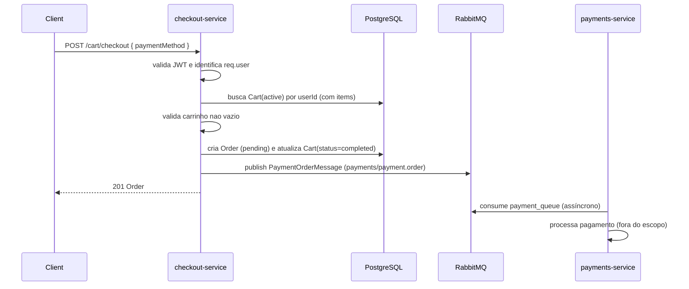
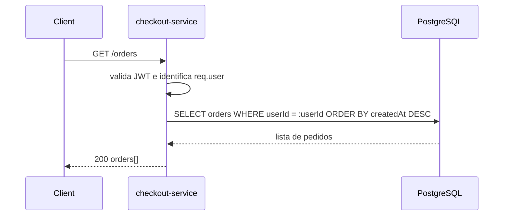
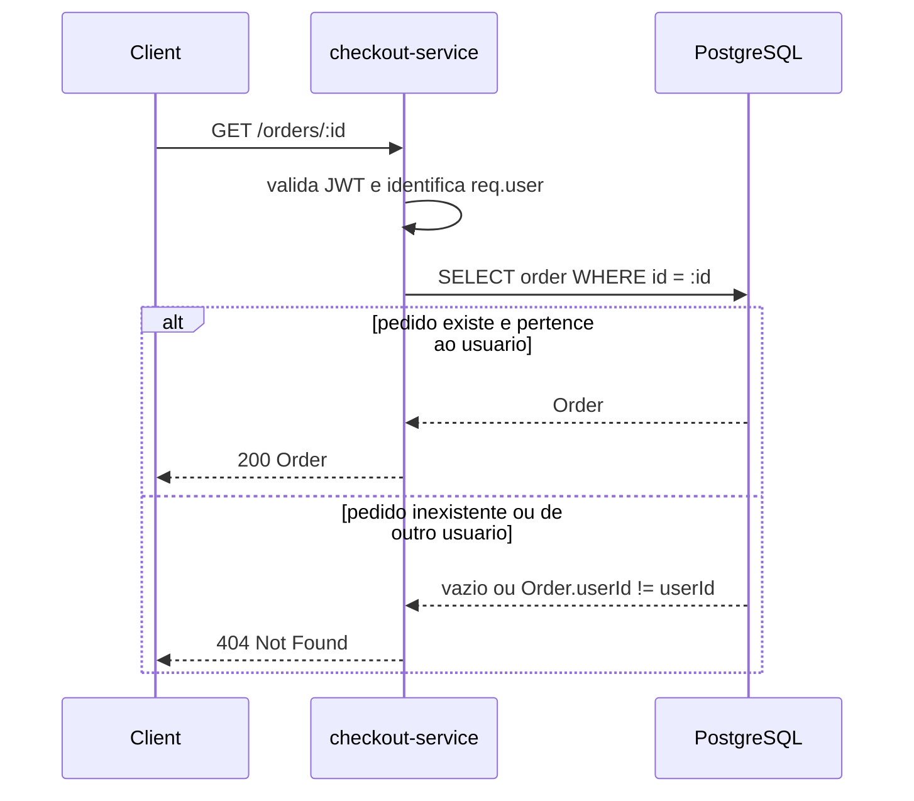

# Spec: Finalização do Pedido (Checkout) e Consultas de Pedidos no checkout-service

## Visão geral

Esta spec define a finalização do carrinho (criação de pedido) e as rotas de consulta de pedidos no `checkout-service` do projeto `marketplace`.

O objetivo desta entrega é permitir que um usuário autenticado:

- finalize seu carrinho ativo gerando uma `Order` com status inicial `pending`;
- dispare o processamento de pagamento de forma assíncrona via RabbitMQ (publicação de evento), sem qualquer lógica de pagamento no `checkout-service`;
- consulte a lista de pedidos e o detalhe de um pedido específico.

### Representação monetária (centavos)

- No `checkout-service`, valores monetários devem permanecer como inteiros em centavos:
  - `Cart.amount`: centavos (`int`)
  - `Order.amount`: centavos (`int`)
  - `CartItem.price`: centavos (`int`)
  - `CartItem.subtotal`: centavos (`int`)
- Conversão para formato decimal (ex: `19999` → `199.99`) é responsabilidade apenas da camada de apresentação (ex: `api-gateway`) e/ou do `payments-service` quando necessário.

| Item | Valor |
|------|-------|
| Serviço | `checkout-service` |
| Porta | `4002` |
| Banco | PostgreSQL |
| Mensageria | RabbitMQ |
| Exchange | `payments` |
| Routing key | `payment.order` |
| Queue (consumidor) | `payment_queue` (no `payments-service`) |
| Escopo | Finalizar carrinho, criar pedido e publicar evento de pagamento; listar e detalhar pedidos |

---

## Fluxos de dados visuais

### Fluxo visual de finalização do carrinho (checkout)

```text
Client
  -> POST /cart/checkout { paymentMethod }
checkout-service
  -> valida JWT
  -> identifica req.user (userId)
  -> busca carrinho active do usuario no PostgreSQL
  -> valida carrinho nao vazio
  -> cria Order (status pending, amount em centavos, vinculo com cartId)
  -> altera Cart.status de active -> completed
  -> publica PaymentOrderMessage no RabbitMQ (exchange payments, routing key payment.order)
  -> retorna Order criada (201)
payments-service (assíncrono)
  -> consome da payment_queue
  -> processa pagamento (fora do escopo do checkout-service)
```



### Fluxo visual de listagem de pedidos do usuário

```text
Client
  -> GET /orders
checkout-service
  -> valida JWT
  -> identifica req.user (userId)
  -> lista Orders do userId (mais recentes primeiro)
  -> retorna array de pedidos
```



### Fluxo visual de detalhe de pedido

```text
Client
  -> GET /orders/:id
checkout-service
  -> valida JWT
  -> identifica req.user (userId)
  -> busca Order por id
  -> valida Order.userId == userId
  -> retorna Order
     ou
  -> 404 se nao existir ou nao pertencer ao usuario
```



---

## 1. Requisitos funcionais

### 1.1 Endpoint `POST /cart/checkout`

O serviço deve expor um endpoint protegido `POST /cart/checkout` para finalizar o carrinho ativo do usuário autenticado, criando um pedido e publicando um evento para processamento assíncrono de pagamento.

Entrada esperada:

- `paymentMethod` (string) com valores permitidos:
  - `credit_card`
  - `debit_card`
  - `pix`
  - `boleto`

Comportamento esperado:

- O endpoint deve identificar o usuário pelo token JWT (usar o identificador do usuário do request como `userId`).
- O serviço deve localizar o carrinho do usuário com status `active`.
- O serviço deve validar que o carrinho ativo existe e não está vazio (possui ao menos 1 item).
- O serviço deve criar uma `Order` com:
  - `userId` (do usuário autenticado);
  - `cartId` (do carrinho finalizado);
  - `amount` (igual ao `Cart.amount`, em centavos);
  - `paymentMethod` (conforme entrada);
  - `status` igual a `pending`.
- O serviço deve alterar o status do carrinho de `active` para `completed` após a criação do pedido.
- O serviço deve publicar um `PaymentOrderMessage` no RabbitMQ imediatamente após a criação do pedido e a conclusão do carrinho.
- O endpoint deve retornar a `Order` criada com status `201 Created`.

Restrições comportamentais obrigatórias:

- A finalização do carrinho deve ser consistente: o sistema não deve deixar carrinho como `completed` sem existir uma `Order` correspondente.
- A publicação do evento deve ocorrer apenas para pedidos efetivamente criados.
- O endpoint não deve iniciar, simular ou “confirmar” pagamento; apenas dispara o evento assíncrono.

### 1.2 Contrato da mensagem `PaymentOrderMessage`

A mensagem publicada pelo `checkout-service` deve ser compatível com a interface esperada pelo `payments-service`:

- `orderId` (UUID da `Order` criada)
- `userId` (UUID do usuário autenticado)
- `amount` (inteiro em centavos; deve ser igual ao `Order.amount`)
- `items[]` com itens contendo:
  - `productId` (UUID do produto)
  - `quantity` (inteiro)
  - `price` (inteiro em centavos)
- `paymentMethod` (string, conforme valores permitidos)
- `description` (opcional)
- `createdAt` (opcional)

Regras do payload:

- `amount` deve refletir o valor total do pedido em centavos.
- `items` deve ser derivado dos itens do carrinho finalizado, preservando o snapshot (`productId`, `quantity`, `price`) existente no `CartItem`.
- O `checkout-service` não deve incluir dados sensíveis, PII adicional ou informações de cartão.
- O contrato publicado deve permanecer compatível com o consumidor; qualquer campo adicional deve ser opcional e não pode quebrar o consumo no `payments-service`.

### 1.3 Endpoint `GET /orders`

O serviço deve expor um endpoint protegido `GET /orders` para listar os pedidos do usuário autenticado.

Comportamento esperado:

- O endpoint deve identificar o usuário pelo token JWT.
- O endpoint deve retornar todos os pedidos vinculados ao `userId` do usuário autenticado.
- A lista deve ser ordenada por data de criação, do mais recente para o mais antigo.
- O endpoint deve retornar `200 OK` com um array de pedidos (possivelmente vazio).

### 1.4 Endpoint `GET /orders/:id`

O serviço deve expor um endpoint protegido `GET /orders/:id` para consultar o detalhe de um pedido específico.

Comportamento esperado:

- O endpoint deve identificar o usuário pelo token JWT.
- O endpoint deve localizar o pedido por identificador.
- O endpoint deve validar que o pedido pertence ao usuário autenticado (`Order.userId` igual ao `userId` autenticado).
- Se não existir o pedido, ou se não pertencer ao usuário autenticado, o endpoint deve retornar `404 Not Found`.
- Se existir e pertencer ao usuário, o endpoint deve retornar `200 OK` com o pedido.

---

## 2. Organização modular

### 2.1 OrdersModule

Deve existir (ou ser ajustado) um `OrdersModule` responsável por centralizar o domínio e a API de pedidos.

Requisitos:

- `OrdersModule` deve importar:
  - `CartModule` (para acesso ao carrinho ativo e seus itens no fluxo de checkout);
  - `EventsModule` (para acesso ao `PaymentQueueService`).
- O módulo deve expor os controllers e services necessários para:
  - finalizar carrinho e criar pedidos;
  - consultar lista de pedidos e detalhe do pedido.

---

## 3. Regras de negócio

### 3.1 Checkout apenas com carrinho ativo e não vazio

- Um usuário só pode finalizar um carrinho com status `active`.
- Um carrinho vazio (sem itens) não pode ser finalizado.

### 3.2 Isolamento por usuário

- Um usuário só pode listar os próprios pedidos.
- Um usuário só pode consultar o detalhe de um pedido se for o dono (`Order.userId`).

### 3.3 Estado do pedido na criação

- Ao criar um pedido via checkout, o status inicial deve ser obrigatoriamente `pending`.

### 3.4 Método de pagamento

- O `paymentMethod` deve ser persistido na `Order` e encaminhado no `PaymentOrderMessage`.
- Apenas os valores definidos em `paymentMethod` são válidos.

---

## 4. Respostas esperadas

### 4.1 `POST /cart/checkout`

- **201 Created**: pedido criado, carrinho concluído e evento de pagamento publicado.
- **400 Bad Request**: payload inválido (ex: `paymentMethod` ausente ou fora do conjunto permitido).
- **401 Unauthorized**: ausência de token, token inválido ou expirado.
- **409 Conflict**: operação não permitida por estado do carrinho (ex: carrinho não está `active`).
- **422 Unprocessable Entity**: carrinho inexistente ou vazio para checkout.

### 4.2 `GET /orders`

- **200 OK**: retorna array de pedidos do usuário (vazio ou não).
- **401 Unauthorized**: ausência de token, token inválido ou expirado.

### 4.3 `GET /orders/:id`

- **200 OK**: retorna o pedido.
- **401 Unauthorized**: ausência de token, token inválido ou expirado.
- **404 Not Found**: pedido não encontrado ou não pertence ao usuário autenticado.

---

## 5. Requisitos de documentação

- Os endpoints `POST /cart/checkout`, `GET /orders` e `GET /orders/:id` devem constar na documentação do `checkout-service`.
- A documentação deve indicar Bearer Auth nos endpoints protegidos.
- A documentação deve explicitar:
  - valores permitidos de `paymentMethod`;
  - que `amount` é retornado em centavos;
  - que o processamento de pagamento é assíncrono e ocorre no `payments-service`.

---

## 6. Requisitos não funcionais (tipagem e padrões)

- Todas as funções, variáveis e parâmetros envolvidos nesta entrega devem ser explicitamente tipados em TypeScript.
- DTOs de entrada e estruturas de saída devem possuir tipos claros e estáveis, evitando `any` e tipagem implícita.
- Controllers devem seguir o padrão de rotas do projeto, incluindo uso do decorator `@Endpoint` para definição de rotas.

---

## 7. Critérios de aceite

### Endpoint de checkout

- [ ] **CA-01** — Existe um endpoint protegido `POST /cart/checkout`.
- [ ] **CA-02** — O endpoint aceita apenas `paymentMethod` ∈ { `credit_card`, `debit_card`, `pix`, `boleto` }.
- [ ] **CA-03** — O endpoint rejeita checkout quando não existe carrinho `active` para o usuário (retorna `422`).
- [ ] **CA-04** — O endpoint rejeita checkout quando o carrinho `active` não possui itens (retorna `422`).
- [ ] **CA-05** — Ao finalizar, o endpoint cria uma `Order` com `userId`, `cartId`, `amount`, `paymentMethod` e `status=pending`.
- [ ] **CA-06** — Ao finalizar, o endpoint altera o carrinho de `active` para `completed`.
- [ ] **CA-07** — Ao finalizar, o endpoint publica uma mensagem no RabbitMQ (exchange `payments`, routing key `payment.order`).
- [ ] **CA-08** — A mensagem publicada contém `orderId`, `userId`, `amount`, `items[]`, `paymentMethod` e é compatível com o contrato esperado pelo `payments-service`.
- [ ] **CA-09** — O endpoint retorna `201 Created` com a `Order` criada.

### Consulta de pedidos

- [ ] **CA-10** — Existe um endpoint protegido `GET /orders`.
- [ ] **CA-11** — O endpoint retorna apenas pedidos do usuário autenticado.
- [ ] **CA-12** — Os pedidos são retornados com ordenação do mais recente para o mais antigo.
- [ ] **CA-13** — Existe um endpoint protegido `GET /orders/:id`.
- [ ] **CA-14** — `GET /orders/:id` retorna `404` quando o pedido não existe.
- [ ] **CA-15** — `GET /orders/:id` retorna `404` quando o pedido existe mas pertence a outro usuário.

### Organização modular e integração de eventos

- [ ] **CA-16** — `OrdersModule` importa `CartModule`.
- [ ] **CA-17** — `OrdersModule` importa `EventsModule`.
- [ ] **CA-18** — O fluxo de checkout usa o `PaymentQueueService` para publicar o evento de pagamento.

### Tipagem e padrões

- [ ] **CA-19** — Não há uso de tipagem implícita para funções, variáveis e parâmetros do fluxo de pedidos/checkout.
- [ ] **CA-20** — Controllers das novas rotas usam o decorator `@Endpoint`.

---

## 8. Fora de escopo

Esta spec não inclui:

- processamento/execução de pagamento (responsabilidade do `payments-service`);
- cancelamento de pedido;
- atualização de status do pedido com base no pagamento;
- reprocessamento, retentativa ou idempotência do lado do consumidor;
- verificação de estoque no checkout;
- aplicação de cupom, frete, taxas, descontos ou split de pagamento;
- validação de ownership/seller do produto para impedir adição ao carrinho;
- endpoints administrativos de pedidos (listar pedidos de todos os usuários, etc.).
