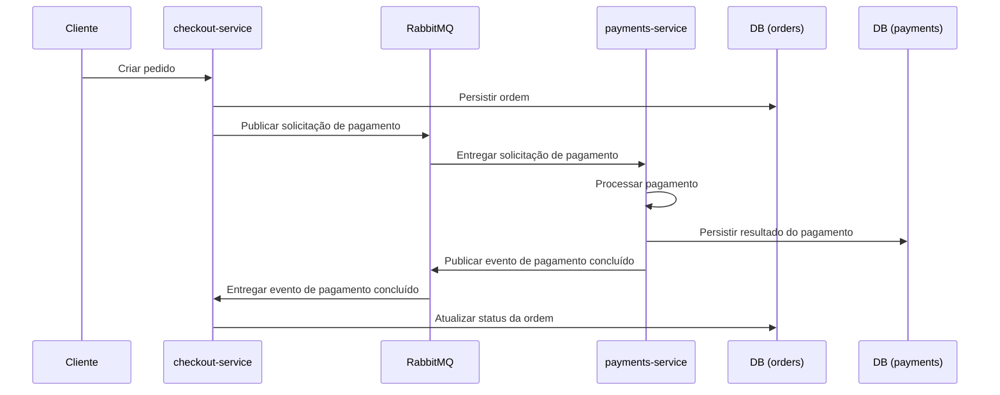

# SPEC — Resposta Assíncrona do Resultado de Pagamento (payments-service → checkout-service)

## Objetivo

Garantir que, após o processamento do pagamento no `payments-service`, o resultado (aprovado ou rejeitado) seja comunicado de forma assíncrona ao `checkout-service` exclusivamente via RabbitMQ, permitindo que o `checkout-service` atualize o status da ordem em seu banco de dados.

## Contexto

- O `checkout-service` persiste ordens e, ao finalizar um pedido, publica uma mensagem de solicitação de pagamento no RabbitMQ.
- O `payments-service` consome a solicitação, processa o pagamento e persiste o resultado.
- Atualmente não existe um retorno assíncrono para informar ao `checkout-service` o resultado final do pagamento.
- A comunicação entre serviços deve continuar sendo exclusivamente via RabbitMQ.

## Escopo

### Em Escopo

- Definição de um evento de domínio publicado pelo `payments-service` ao concluir o processamento do pagamento (estado final).
- Regras de publicação do evento (momento de publicação, unicidade por processamento concluído e conteúdo mínimo).
- Consumo do evento no `checkout-service` para atualização de status da ordem persistida.
- Requisitos de consistência e idempotência compatíveis com mensageria com reentrega (at-least-once).

### Fora de Escopo (Não Fazer)

- Alterar o fluxo atual de criação de pedidos no `checkout-service`.
- Substituir RabbitMQ por comunicação síncrona entre serviços.
- Implementar webhooks ou callbacks HTTP entre serviços.
- Alterar o processamento interno do pagamento no `payments-service` além da publicação do evento de conclusão.
- Alterar endpoints HTTP existentes (incluindo métricas, health check e DLQ) em qualquer serviço.

## Contratos e Integração

### Evento de resultado do pagamento

O `payments-service` deve publicar um evento de domínio que represente a conclusão do processamento do pagamento, com o seguinte payload lógico mínimo:

`PaymentProcessingResultEvent`:

- `orderId` (UUID)
- `paymentId` (UUID)
- `status` (`approved` ou `rejected`)
- `transactionId` (string; quando existir)
- `rejectionReason` (string; quando existir)
- `processedAt` (timestamp em formato ISO-8601)

Regras de consistência do payload:

- `transactionId` deve existir quando `status` for `approved`.
- `rejectionReason` deve existir quando `status` for `rejected`.
- O evento deve representar o estado final do pagamento (apenas `approved` ou `rejected`).

Propósito do evento:

- Notificar, de forma assíncrona, o `checkout-service` sobre o resultado final do pagamento de uma ordem já persistida, para que o status da ordem possa ser atualizado de forma consistente com o domínio de checkout.

Momento de publicação:

- O evento deve ser publicado imediatamente após a conclusão do processamento do pagamento, quando o resultado final já estiver persistido com sucesso.

### Publicação do evento

Requisitos:

- O evento deve ser publicado apenas após o pagamento ter sido persistido com sucesso com estado final (`approved` ou `rejected`).
- Apenas um evento deve ser publicado para cada processamento concluído (um pagamento concluído deve resultar em um único evento).
- O evento publicado deve sempre representar o estado final do pagamento (não publicar eventos intermediários como `pending`).
- A publicação deve ser idempotente do ponto de vista do domínio, tolerando reprocessamentos e reentregas da mensagem de solicitação, sem produzir múltiplos eventos finais conflitantes para o mesmo `orderId`.

## Consumo do evento no checkout-service

O `checkout-service` deve:

- Consumir o evento publicado pelo `payments-service`.
- Localizar a ordem pelo `orderId`.
- Atualizar o status da ordem conforme o resultado do pagamento.

Mapeamento esperado:

- Pagamento aprovado → ordem `APPROVED`
- Pagamento rejeitado → ordem `PAYMENT_REJECTED`

Tratamento de erro:

- Se a ordem não for encontrada pelo `orderId`, o consumo deve tratar como falha de processamento e seguir a estratégia de mensageria existente (retry e DLQ), garantindo que o comportamento seja consistente com o padrão atual do serviço.

Requisitos de idempotência no consumo:

- O consumo do evento deve ser idempotente sempre que possível, de modo que reentregas do mesmo evento não deixem a ordem em estado inconsistente.

## Responsabilidades dos serviços

### payments-service

- Processar o pagamento.
- Persistir o resultado do pagamento.
- Publicar o evento de conclusão do pagamento com o resultado final (`approved` ou `rejected`).

### checkout-service

- Consumir o evento de conclusão do pagamento.
- Atualizar o status da ordem em seu banco de dados conforme o resultado do pagamento.
- Não realizar nenhum processamento de pagamento.

## Fluxo da arquitetura

Fluxo completo esperado:

1. Cliente cria pedido.
2. `checkout-service` persiste a ordem.
3. `checkout-service` publica solicitação de pagamento no RabbitMQ.
4. `payments-service` consome a mensagem.
5. `payments-service` processa o pagamento.
6. `payments-service` persiste o resultado.
7. `payments-service` publica evento de pagamento concluído.
8. `checkout-service` consome o evento.
9. `checkout-service` atualiza o status da ordem.

Visão rápida (ASCII):

```
Cliente
  |
  v
checkout-service  --(solicitação de pagamento)-->  RabbitMQ  -->  payments-service
      |                                                        |
      v                                                        v
 DB (orders)                                             DB (payments)
      ^                                                        |
      |                                                        v
checkout-service  <--(evento: resultado do pagamento)---  RabbitMQ  <-- payments-service
```

Sequência (Mermaid):



## Requisitos de consistência

- Comunicação assíncrona baseada em eventos, exclusivamente via RabbitMQ.
- A atualização do status da ordem deve ocorrer apenas após o recebimento de um evento válido de resultado de pagamento.
- O processamento deve ser idempotente sempre que possível, considerando reentrega e reprocessamento de mensagens.
- Mensagens devem representar eventos de domínio (estado ocorrido no domínio de pagamentos) e não chamadas remotas entre serviços.
- O sistema deve tolerar duplicidade de mensagens e reentrega sem produzir estados finais inconsistentes.

## Critérios de Aceite (AC)

### AC-01 — Pagamento aprovado gera evento aprovado

- Ao concluir um pagamento com `status=approved`, o `payments-service` publica um evento `PaymentProcessingResultEvent` com `status=approved` e `transactionId` preenchido.

### AC-02 — Pagamento rejeitado gera evento rejeitado

- Ao concluir um pagamento com `status=rejected`, o `payments-service` publica um evento `PaymentProcessingResultEvent` com `status=rejected` e `rejectionReason` preenchido.

### AC-03 — Evento publicado apenas após persistência

- O evento de conclusão do pagamento é publicado somente após o registro de pagamento estar persistido com sucesso em estado final.

### AC-04 — Unicidade do evento por processamento concluído

- Para cada pagamento concluído (por `orderId`), apenas um evento final é publicado.

### AC-05 — checkout-service atualiza status corretamente

- Ao consumir um evento válido:
  - `approved` atualiza a ordem para `APPROVED`.
  - `rejected` atualiza a ordem para `PAYMENT_REJECTED`.

### AC-06 — Ordem não permanece pendente após evento válido

- Após o `checkout-service` consumir um evento válido para uma ordem existente, a ordem não permanece em estado pendente.

### AC-07 — Falhas de consumo seguem retry e DLQ

- Falhas no consumo do evento no `checkout-service` seguem a estratégia existente de retry e DLQ.

### AC-08 — Nenhum endpoint HTTP existente é alterado

- Nenhum endpoint HTTP existente (métricas, health check, DLQ e demais rotas já expostas) é alterado em qualquer serviço.

